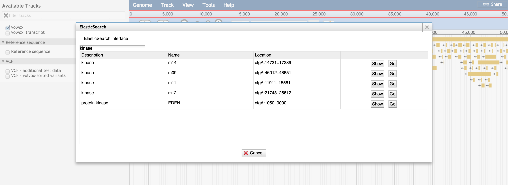

# jbrowse_elasticsearch

A JBrowse add-on for indexing names with elasticsearch. Allows searching full text descriptions of genes!

## Pre-requisites

- elasticsearch
- nodejs/npm
- cpanm

## Installation

Run the setup script

    bash setup.sh

Then load your tracks

    flatfile-to-json.pl --nameAttributes note,id,description,name --gff docs/tutorial/data_files/volvox.gff3 --trackLabel test --trackType CanvasFeatures

And then load the tracks into elasticsearch

    bin/generate-elastic-search.pl

Then add the plugin to JBrowse by adding something like this to trackList.json or `jbrowse_conf.json`

    "plugins": ["ElasticSearch"]

Finally start the helper app (starts app.js as middleware for elasticsearch queries)

    npm start

## Loading full text descriptions

If you have a feature such as

    chr23  RefSeq  gene    2475803 2809862 .   -   .   ID=gene28777;Name=514682;Dbxref=NCBI_Gene:514682,BGD:BT30338;symbol_ncbi=PRIM2;description=primase%2C DNA%2C polypeptide 2 (58kDa);gene_synonym=PRIM2A;feature_type=Protein Coding

Then running

    flatfile-to-json.pl --trackLabel RefSeq --gff file.gff --nameAttributes symbol_ncbi,gene_synonym,description,dbxref

This would make `symbol_ncbi` the "primary key" and associate the `gene_synonym`, `description`, and `dbxref` as "descriptions" of that gene (the search box doesn't distinguish the field type, they all just become descriptions)

 
## Screenshot

## Configuration

- elasticSearchUrl - the location of the express.js middleware, e.g. http://localhost:3000
- elasticIndexName - optional: the name of a specific elastic index that you loaded data into, normally used if you have multiple genomes

These are automatically added to trackList.json by the bin/generate-elastic-search.pl

## Troubleshooting

* The setup.sh installs the jbrowse libs to the system with cpanm, if there are problems with setup.sh make sure cpanm is installed correctly

* For the gene descriptions to be indexed, the `--nameAttributes` flag should be used with flatfile-to-json.pl with something like `--nameAttributes name,description,other_field_to_index`. By default --nameAttributes is id,name,alias. The order of arguments in --nameAttributes is important, the first should be the unique name, id or symbol (or whatever is acceptable to appear in the name box in the popup). Other arguments after the first are then all associated with the first as descriptions, with multiple descriptions being allowed

* If your tracklist significantly changes you may need to regenerate your names index (the elasticsearch data refers to indexes in the tracks and if your tracklist changes then you will not be referring to the correct track, jbrowse default generate-names.pl does this also)

* If your descriptions are on the "mRNA" features in your GFF but you load at the "gene" level then your descriptions will not be indexed. You can create an extra track loaded at the "mRNA" level using --type mRNA in flatfile-to-json.pl and then re-run the generate-elastic-search pipeline. 

## Multiple genomes configuration

Use --genome argument to bin/generate-elastic-search.pl which creates different indexes (the elasticsearch equivalent of a different database) for each genome that your run

## Middleware configuration

Normally, you can start the express.js middleware for jbrowse_elasticsearch (a small service that queries elasticsearch for you) by running "npm install" and "npm start" in the root folder of this repo. In a production configuration, you may wish to use a reverse proxy to make this accessible from a standard http endpoint rather than opening up port 3000 to the public. Therefore put something like this basic config in your apache config file

    ProxyPass /elastic http://localhost:3000
    ProxyPassReverse /elastic http://localhost:3000

Read up on reverse proxies before doing so. Forward proxies are dangerous and you do not want to enable this, but a configuration like the above is safe. You can also, instead of relying on "npm start" to keep the service running, run it on Passenger Phusion

    Alias /elasticsearch /mnt/webdata/jbrowse/plugins/ElasticSearch
    <Location /elasticsearch>
        PassengerBaseURI /elasticsearch
        PassengerAppRoot /mnt/webdata/jbrowse/plugins/ElasticSearch

        PassengerAppType node
        PassengerStartupFile bin/www
    </Location>

Then point the elasticSearchUrl parameter to http://yoursite/elasticsearch

Note that the express.js middleware is pretty small, but it is recommended to use an endpoint like this rather than expose the elasticsearch REST API to the public.

## Defaults

* http://localhost:3000 is the default express.js port, can be overridden in app.js and in --url param to generate-elastic-search.pl

* http://localhost:9200 is the default elasticsearch port, can be overridden in app.js and in --elasticurl param to generate-elastic-search.pl

## Feedback

Feel free to provide feedback, my first foray into elasticsearch!

